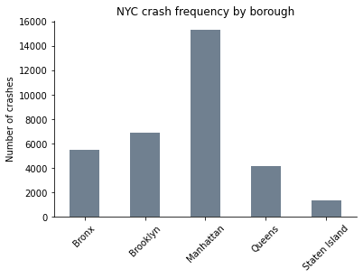
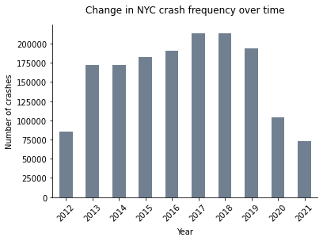
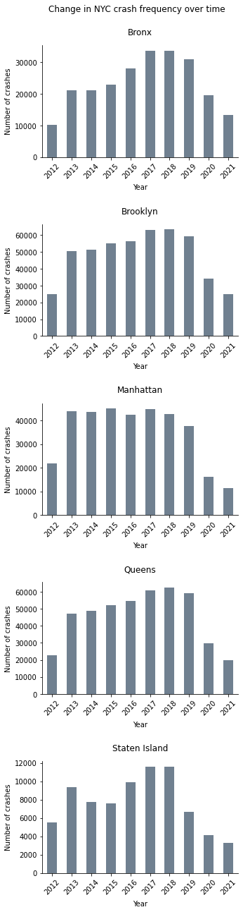
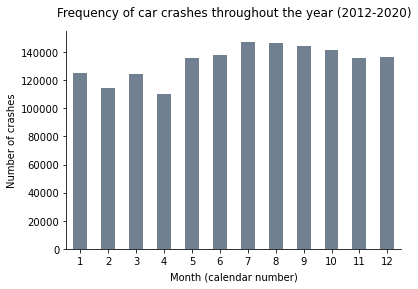
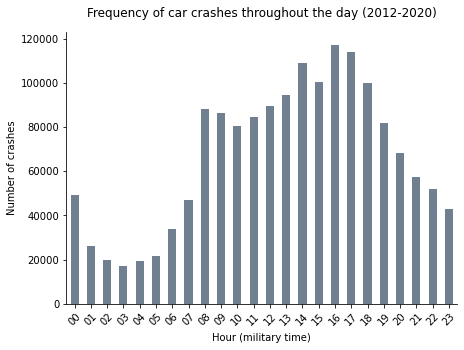
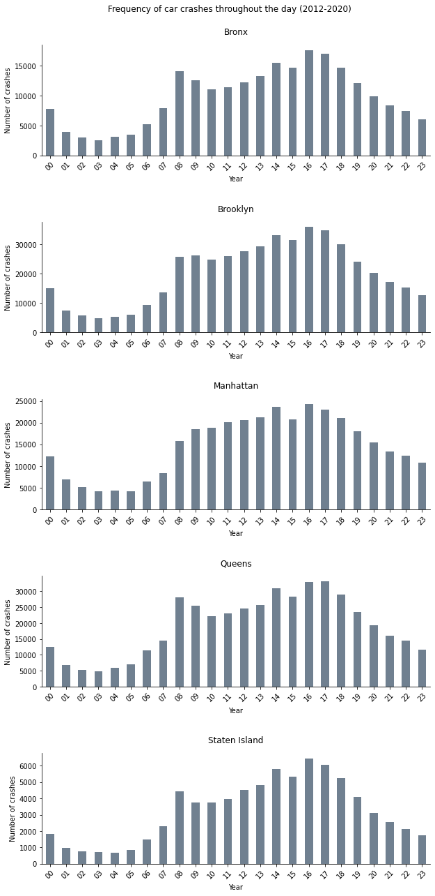

**_This notebook analyzes NYC collision data across space and time._**

Author: Monica Hersher

### Import and repair necessary packages


```python
import pandas as pd
import geopandas as gpd
import pyproj
import matplotlib.pyplot as plt

#My conda environment points to the wrong database path so I need to fix this to be able to set the crs of my geodataframe
print(pyproj.datadir.get_data_dir())
pyproj.datadir.set_data_dir('/usr/local/anaconda3/envs/geo_env_work_pyproj/share/proj')
```

    /usr/local/anaconda3/envs/geo_env_work_pyproj/share/proj


### Import and clean car crash data

This dataset tracks car crashes across the city of New York. I am interested in the location and date of the car crashes for this analysis.
Data source: https://data.cityofnewyork.us/Public-Safety/Motor-Vehicle-Collisions-Crashes/h9gi-nx95


```python
#Load data - read CRASH DATE column as datetime date type
crashes_df = pd.read_csv('data/raw_data/Motor_Vehicle_Collisions_-_Crashes.csv', parse_dates = ['CRASH DATE'])

#Make column names easier to work with in python
crashes_df.columns = [column.strip().replace(' ', '_').lower() for column in crashes_df.columns]

#Drop the events that have invalid latitudes and longitudes
crashes_df.dropna(subset = ['latitude', 'longitude'], how = 'any', inplace= True)
crashes_df = crashes_df[(crashes_df['latitude'] != 0) & (crashes_df['longitude'] != 0)]
```

    /usr/local/anaconda3/envs/geo_env_work_pyproj/lib/python3.9/site-packages/IPython/core/interactiveshell.py:3169: DtypeWarning: Columns (3) have mixed types.Specify dtype option on import or set low_memory=False.
      has_raised = await self.run_ast_nodes(code_ast.body, cell_name,


```python
crashes_df.head()
```


<div>
<style scoped>
    .dataframe tbody tr th:only-of-type {
        vertical-align: middle;
    }

    .dataframe tbody tr th {
        vertical-align: top;
    }

    .dataframe thead th {
        text-align: right;
    }
</style>
<table border="1" class="dataframe">
  <thead>
    <tr style="text-align: right;">
      <th></th>
      <th>crash_date</th>
      <th>crash_time</th>
      <th>borough</th>
      <th>zip_code</th>
      <th>latitude</th>
      <th>longitude</th>
      <th>location</th>
      <th>on_street_name</th>
      <th>cross_street_name</th>
      <th>off_street_name</th>
      <th>...</th>
      <th>contributing_factor_vehicle_5</th>
      <th>collision_id</th>
      <th>vehicle_type_code_1</th>
      <th>vehicle_type_code_2</th>
      <th>vehicle_type_code_3</th>
      <th>vehicle_type_code_4</th>
      <th>vehicle_type_code_5</th>
      <th>geometry</th>
      <th>crash_year</th>
      <th>crash_month</th>
    </tr>
  </thead>
  <tbody>
    <tr>
      <th>1</th>
      <td>2021-04-13</td>
      <td>21:35</td>
      <td>BROOKLYN</td>
      <td>11217.0</td>
      <td>40.683580</td>
      <td>-73.976170</td>
      <td>(40.68358, -73.97617)</td>
      <td>NaN</td>
      <td>NaN</td>
      <td>620       ATLANTIC AVENUE</td>
      <td>...</td>
      <td>NaN</td>
      <td>4407147</td>
      <td>Sedan</td>
      <td>NaN</td>
      <td>NaN</td>
      <td>NaN</td>
      <td>NaN</td>
      <td>POINT (-73.97617 40.68358)</td>
      <td>2021</td>
      <td>4</td>
    </tr>
    <tr>
      <th>13</th>
      <td>2019-05-21</td>
      <td>22:50</td>
      <td>BROOKLYN</td>
      <td>11201.0</td>
      <td>40.697540</td>
      <td>-73.983120</td>
      <td>(40.69754, -73.98312)</td>
      <td>GOLD STREET</td>
      <td>CONCORD STREET</td>
      <td>NaN</td>
      <td>...</td>
      <td>NaN</td>
      <td>4136992</td>
      <td>�MBU</td>
      <td>Taxi</td>
      <td>NaN</td>
      <td>NaN</td>
      <td>NaN</td>
      <td>POINT (-73.98312 40.69754)</td>
      <td>2019</td>
      <td>5</td>
    </tr>
    <tr>
      <th>15</th>
      <td>2021-02-26</td>
      <td>14:50</td>
      <td>BRONX</td>
      <td>10461.0</td>
      <td>40.843464</td>
      <td>-73.836000</td>
      <td>(40.843464, -73.836)</td>
      <td>NaN</td>
      <td>NaN</td>
      <td>2819      MIDDLETOWN ROAD</td>
      <td>...</td>
      <td>NaN</td>
      <td>4395664</td>
      <td>Station Wagon/Sport Utility Vehicle</td>
      <td>NaN</td>
      <td>NaN</td>
      <td>NaN</td>
      <td>NaN</td>
      <td>POINT (-73.83600 40.84346)</td>
      <td>2021</td>
      <td>2</td>
    </tr>
    <tr>
      <th>16</th>
      <td>2021-03-09</td>
      <td>11:00</td>
      <td>NaN</td>
      <td>NaN</td>
      <td>40.692547</td>
      <td>-73.990974</td>
      <td>(40.692547, -73.990974)</td>
      <td>COURT STREET</td>
      <td>JORALEMON STREET</td>
      <td>NaN</td>
      <td>...</td>
      <td>NaN</td>
      <td>4397513</td>
      <td>Pick-up Truck</td>
      <td>Sedan</td>
      <td>NaN</td>
      <td>NaN</td>
      <td>NaN</td>
      <td>POINT (-73.99097 40.69255)</td>
      <td>2021</td>
      <td>3</td>
    </tr>
    <tr>
      <th>17</th>
      <td>2021-03-31</td>
      <td>22:20</td>
      <td>BROOKLYN</td>
      <td>11234.0</td>
      <td>40.626457</td>
      <td>-73.918000</td>
      <td>(40.626457, -73.918)</td>
      <td>RALPH AVENUE</td>
      <td>AVENUE K</td>
      <td>NaN</td>
      <td>...</td>
      <td>NaN</td>
      <td>4403773</td>
      <td>Sedan</td>
      <td>Sedan</td>
      <td>NaN</td>
      <td>NaN</td>
      <td>NaN</td>
      <td>POINT (-73.91800 40.62646)</td>
      <td>2021</td>
      <td>3</td>
    </tr>
  </tbody>
</table>
<p>5 rows × 32 columns</p>
</div>


### Use latitude and longitude columns to create a point geometry
I created a point geometry in a GeoDataFrame.


```python
crashes_gdf = gpd.GeoDataFrame(crashes_df, geometry=gpd.points_from_xy(crashes_df['longitude'], crashes_df['latitude']))
crashes_gdf = crashes_gdf.set_crs(epsg = 4326)
```

### Extract the year and the month from the crash date column


```python
crashes_gdf['crash_year'] = crashes_gdf['crash_date'].dt.year
crashes_gdf['crash_month'] = crashes_gdf['crash_date'].dt.month
```

### Examine whether all crashes have borough names associated with them


```python
#Many crashes are missing boroughs
print('Number of crashes missing borough:', crashes_gdf[crashes_gdf['borough'].isna()].shape[0])
```

    Number of crashes missing borough: 381621


### Fix the missing boroughs by merging in a borough shapefile and categorizing each event by the borough polygon it falls within

_Note: This cell will take a few minutes to run due to the size of the dataset_

Borough Data Source: https://data.cityofnewyork.us/City-Government/Borough-Boundaries/tqmj-j8zm


```python
#Spatially merge in boroughs so that the ones missing that column have it - inner merge will automatically drop any crashes that don't fall within boroughs and are improperly labeled
borough_gdf = gpd.read_file('data/raw_data/Borough Boundaries/geo_export_7187814d-45eb-4045-9eba-b102ccd9a460.shp')
crashes_with_borough_gdf = gpd.sjoin(crashes_gdf, borough_gdf[['boro_name', 'geometry']], how="inner", op='intersects')

```


```python
# crashes_with_borough_gdf.drop(columns = ['crash_date']).to_file('data/processed_data/nyc_crashes_with_boundaries.shp')
```

### Spatial-temporal analysis

#### Which borough has the most crashes per square mile?
_This uses the borough column that was spatially merged into geodataframe._

The result of this is not shocking. Manhattan is very densely populated and is where many people commute into work so it makes sense that there would be a lot of crashes in it per square mile. It could be interesting to look at it normalized to the number of people living in that area, though that might be slightly misleading since the people getting in car crashes in a borough might not necessarily live there.


```python
#Calculate area of each borough to be able to normalize counts (have to convert from 4326 to projected crs to do this)
borough_gdf['areaSqFt'] = borough_gdf.to_crs(epsg=2263).area
borough_gdf['areaSqMi'] = borough_gdf['areaSqFt']/27880000

```


```python
#Counts of crashes per square mile in each borough using spatially merged borough column

#Calculate and normalize data
counts_df = crashes_with_borough_gdf.groupby('boro_name')['collision_id'].count().reset_index().rename(columns = {'collision_id':'number_crashes'})
counts_df_normalize = pd.merge(counts_df, borough_gdf[['boro_name', 'areaSqMi']], on = 'boro_name')
counts_df_normalize['num_crashes_perSqMi'] = counts_df_normalize['number_crashes']/counts_df_normalize['areaSqMi']

fig, axs = plt.subplots()
counts_df_normalize.plot.bar(x = 'boro_name', y = 'num_crashes_perSqMi', ax = axs, color = 'slategray', legend = False)
axs.set_xlabel('', labelpad = 6)
axs.set_ylabel('Number of crashes')
axs.set_title('NYC crash frequency by borough')
axs.set_xticklabels(axs.get_xticklabels(), rotation=45)
axs.spines['top'].set_visible(False)
axs.spines['right'].set_visible(False)

display()
```





#### How has the number of crashes in New York City changed over time?

You can distincly see the effects of the pandemic in this graph. As more people stayed home, fewer people got in crashes. I'm curious though what happened on the other end of the graph. Is the significant increase in crashes between 2012 and 2013 a reflection of a true increase or was there a change in how the data was recorded?


```python
#Plot how crashes have changed over time
fig, axs = plt.subplots()
crashes_with_borough_gdf.groupby('crash_year')['collision_id'].count().plot.bar(ax = axs, color = 'slategray')
axs.set_xlabel('Year', labelpad = 6)
axs.set_ylabel('Number of crashes')
axs.set_title('Change in NYC crash frequency over time', pad = 15)
axs.set_xticklabels(axs.get_xticklabels(), rotation=45)
axs.spines['top'].set_visible(False)
axs.spines['right'].set_visible(False)

display()
```





#### Has this change in crashes over time been consistent across boroughs?

_I did not normalize these stats because I'm comparing boroughs to themselves in past years._

While Manhattan has had relatively consistent crash records since 2013 before the pandemic, other boroughs have seen more of a shift. In the Bronx and Queens car crashes became more frequent in the second half of the 2010s. I wonder if this reflects a change in the population or commuting dynamics of these places.


```python
#Counts of crashes in each borough over time
fig, axs = plt.subplots(5,1, figsize = (5, 20))
fig.subplots_adjust(top=0.94,wspace=0.2, hspace=0.6)

grouped = crashes_with_borough_gdf.groupby(['boro_name'])
i = 0
for group_name, group_df in grouped:
    group_df.groupby('crash_year')['collision_id'].count().plot.bar(ax = axs[i], color = 'slategray')
    fig.suptitle('Change in NYC crash frequency over time')
    axs[i].set_title('{}'.format(group_name))
    axs[i].set_xlabel('Year', labelpad = 6)
    axs[i].set_ylabel('Number of crashes')
    axs[i].set_title('{}'.format(group_name), pad = 15)
    axs[i].set_xticklabels(axs[i].get_xticklabels(), rotation=45)
    axs[i].spines['top'].set_visible(False)
    axs[i].spines['right'].set_visible(False)
    i += 1
```





### Are car crashes more common in some months than others?

Interestingly no! I expected there to be an increase in car crashes in winter months as people retreated to cars to get around. It appears that the main thing driving car crashes is potentially essential travel that does not vary with the season.


```python
#Counts of crashes in each month
fig, axs = plt.subplots()
crashes_with_borough_gdf.groupby('crash_month')['collision_id'].count().plot.bar(ax = axs, color = 'slategray')
axs.set_xlabel('Month (calendar number)', labelpad = 6)
axs.set_ylabel('Number of crashes')
axs.set_title('Frequency of car crashes throughout the year (2012-2020)', pad = 15)
axs.set_xticklabels(axs.get_xticklabels(), rotation=360)
axs.spines['top'].set_visible(False)
axs.spines['right'].set_visible(False)

display()
```





### Are car crashes more common in certain parts of the day?

While more crashes unsurprisingly happen during the day than at night, I was surprised to see that so many crashes are still occurring around midnight. It is also interesting that more crashes occur in the evening hours compared to the morning hours, reflecting the threat of tired driving.


```python
#Counts of crashes in each hour of the day
crashes_with_borough_gdf['crash_hour'] = crashes_with_borough_gdf['crash_time'].str.zfill(5).str[:2]

fig, axs = plt.subplots(figsize = (7, 5))
crashes_with_borough_gdf.groupby('crash_hour')['collision_id'].count().plot.bar(ax = axs, color = 'slategray')
axs.set_xlabel('Hour (military time)', labelpad = 6)
axs.set_ylabel('Number of crashes')
axs.set_title('Frequency of car crashes throughout the day (2012-2020)', pad = 15)
axs.set_xticklabels(axs.get_xticklabels(), rotation=45)
axs.spines['top'].set_visible(False)
axs.spines['right'].set_visible(False)

display()
```





### Does the distribution of car crashes throughout the day vary in each borough?
_Again not normalized because comparing boroughs with themselves across time, not to each other._

The distribution is similar in each borough. I would have expected that collisions are worse at night in Manhattan and Brooklyn, where the nightlife is more vibrant, but it appears that every borough has the same relative frequency of collisions at night. One noteable difference is that the Bronx and Queens do see more similar numbers of collisions in their morning and evening commutes than in Manhattan.


```python
#Counts of crashes in each hour of each day by borough
fig, axs = plt.subplots(5,1, figsize = (10, 20))
fig.subplots_adjust(wspace=0.2, hspace=0.6, top = .94)

grouped = crashes_with_borough_gdf.groupby(['boro_name'])
i = 0
for group_name, group_df in grouped:
    group_df.groupby('crash_hour')['collision_id'].count().plot.bar(ax = axs[i], color = 'slategray')
    fig.suptitle('Frequency of car crashes throughout the day (2012-2020)')
    axs[i].set_title('{}'.format(group_name))
    axs[i].set_xlabel('Year', labelpad = 6)
    axs[i].set_ylabel('Number of crashes')
    axs[i].set_title('{}'.format(group_name), pad = 15)
    axs[i].set_xticklabels(axs[i].get_xticklabels(), rotation=45)
    axs[i].spines['top'].set_visible(False)
    axs[i].spines['right'].set_visible(False)
    i += 1
```





### If I had more time...

- Look at all of this by the type of crash
- Map the collisions and see if there are any intersections with particularly bad records. I would also be interested in combining this with city government street construction records and see whether revisions to streets improves the frequency of collisions


```python

```
