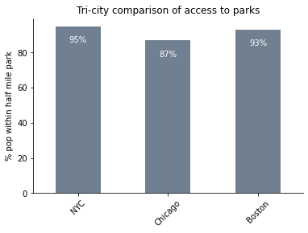

### Assignment 4 - Areal interpolation

Research question: Which city - New York, Chicago, or Boston - has a higher percent of the population living within a half mile of a public park?

**Datasets**
1. Park shapefiles:

NYC: https://data.cityofnewyork.us/Recreation/Open-Space-Parks-/g84h-jbjm

Chicago: https://data.cityofchicago.org/Parks-Recreation/Parks-Chicago-Park-District-Park-Boundaries-curren/ej32-qgdr

Boston: https://data.boston.gov/dataset/open-space


2. City boundary shapefiles:

NYC: https://data.cityofnewyork.us/City-Government/Borough-Boundaries/tqmj-j8zm

Chicago: https://data.cityofchicago.org/Facilities-Geographic-Boundaries/Boundaries-City/ewy2-6yfk

Boston: https://data.boston.gov/dataset/city-of-boston-boundary


3. American Community Survey 5-year 2014-19 Population Data at the Census Tract Level:

https://data2.nhgis.org/

4. 2019 Census Tract shapefiles for Massachusetts, Illinois, and New York: 

https://www.census.gov/cgi-bin/geo/shapefiles/index.php?year=2019&layergroup=Census+Tracts

#### Load packages


```python
import pandas as pd
import geopandas as gpd
import pyproj
import matplotlib.pyplot as plt


#My conda environment points to the wrong database path so I need to fix this to be able to set the crs of my geodataframe
print(pyproj.datadir.get_data_dir())
pyproj.datadir.set_data_dir('/usr/local/anaconda3/envs/geo_env_work_pyproj/share/proj')
```

    /usr/local/anaconda3/envs/geo_env_work_pyproj/share/proj


#### Step 1

Load park shapefiles and reproject them all to a projected crs so I can do buffer calculation. I chose the USA Contiguous Albers Equal Area Conic projection since it's relatively accurate for all of contiguous US. It's distance is in meters.


```python
nyc_parks = gpd.read_file('data/raw_data/parks/nyc_parks/geo_export_338e6c6e-4d0a-4908-98e3-efc6b21a1592.shp')
nyc_parks = nyc_parks.to_crs(epsg = 5070)

chicago_parks = gpd.read_file('data/raw_data/parks/chicago_parks/geo_export_51d278f1-a79e-4aaa-93f5-95b6b3d29e93.shp')
chicago_parks = chicago_parks.to_crs(epsg = 5070)


boston_parks = gpd.read_file('data/raw_data/parks/boston_parks/Open_Space.shp')
boston_parks = boston_parks.to_crs(epsg = 5070)

```

#### Step 2
Add half mile (804m) buffer around all park geometries and dissolve into one geometry to deal with overlapping buffers


```python
#Add a half mile buffer around all parks
nyc_parks['geometry'] = nyc_parks.buffer(804.672)
chicago_parks['geometry'] = chicago_parks.buffer(804.672)
boston_parks['geometry'] = boston_parks.buffer(804.672)

#Dissolve geometries into one in case any overlap
nyc_parks_dissolved = nyc_parks.dissolve()
chicago_parks_dissolved = chicago_parks.dissolve()
boston_parks_dissolved = boston_parks.dissolve()

```

#### Step 3

Load census tract Tiger Line files in Massachusetts, Illinois, and New York and reproject


```python
ny_tract_boundary = gpd.read_file('data/raw_data/2019_tract_boundaries_by_state/tl_2019_36_tract/tl_2019_36_tract.shp')
ny_tract_boundary = ny_tract_boundary.to_crs(epsg = 5070)

il_tract_boundary = gpd.read_file('data/raw_data/2019_tract_boundaries_by_state/tl_2019_17_tract/tl_2019_17_tract.shp')
il_tract_boundary = il_tract_boundary.to_crs(epsg = 5070)

ma_tract_boundary = gpd.read_file('data/raw_data/2019_tract_boundaries_by_state/tl_2019_25_tract/tl_2019_25_tract.shp')
ma_tract_boundary = ma_tract_boundary.to_crs(epsg = 5070)
```

#### Step 4

Subset the tracts that intersect with each city boundary (decreases dataset size for joins and makes it easy to get a rough count of the city population size for the denominator)

**Note**: Technically to get the city population denominator I should check if there are any tracts that partially intersect with the city boundary and conduct an areal interpolation on this too, but there shouldn't be many where this is true and a little bit of error won't change the denominator by much. I've decided to not tackle this and focus on the main areal interpolation with the park buffers.


```python
nyc_boundary = gpd.read_file('data/raw_data/city_boundaries/nyc_boundary/geo_export_b5b1f8dc-e786-4d8d-9154-87b05faab6f2.shp')
nyc_boundary = nyc_boundary.to_crs(epsg = 5070)

chicago_boundary = gpd.read_file('data/raw_data/city_boundaries/chicago_boundary/geo_export_d8a28fc0-1754-4e44-96ee-278df17fb883.shp')
chicago_boundary = chicago_boundary.to_crs(epsg = 5070)

boston_boundary = gpd.read_file('data/raw_data/city_boundaries/City_of_Boston_Boundary/City_of_Boston_Boundary.shp')
boston_boundary = boston_boundary.to_crs(epsg = 5070)

nyc_tract_boundary = gpd.sjoin(ny_tract_boundary, nyc_boundary, how = 'inner', op = 'intersects')
chicago_tract_boundary = gpd.sjoin(il_tract_boundary, chicago_boundary, how = 'inner', op = 'intersects')
boston_tract_boundary = gpd.sjoin(ma_tract_boundary, boston_boundary, how = 'inner', op = 'intersects')

```

#### Step 5

Subset the tracts that intersect with the buffered parks (further decreases dataset size for joins)


```python
nyc_tract_boundary_subset = gpd.sjoin(nyc_tract_boundary.drop(columns = ['index_right']), nyc_parks_dissolved, how = 'inner', op = 'intersects')

chicago_tract_boundary_subset = gpd.sjoin(chicago_tract_boundary.drop(columns = ['index_right']), chicago_parks_dissolved, how = 'inner', op = 'intersects')

boston_tract_boundary_subset = gpd.sjoin(boston_tract_boundary.drop(columns = ['index_right']), boston_parks_dissolved, how = 'inner', op = 'intersects')

```

#### Step 6

Fixing duplicates. There is an issue with some tracts intersecting with multiple park buffers in NYC. Dropping the duplicate instances since we just want this to be a unique list of all parks that intersect with at least one park buffer.


```python

print(nyc_tract_boundary_subset.shape)
print(nyc_tract_boundary_subset.drop_duplicates(subset = 'GEOID').shape)
nyc_tract_boundary_subset = nyc_tract_boundary_subset.drop_duplicates(subset = 'GEOID')

print(chicago_tract_boundary_subset.shape)
print(chicago_tract_boundary_subset.drop_duplicates(subset = 'GEOID').shape)

print(boston_tract_boundary_subset.shape)
print(boston_tract_boundary_subset.drop_duplicates(subset = 'GEOID').shape)
```

    (2194, 29)
    (2194, 29)
    (851, 99)
    (851, 99)
    (212, 43)
    (212, 43)


#### Step 6

Calculate the area of each tract that intersects with the buffered parks (ie. all tracts that are entirely or partially within a half mile of a park)


```python
nyc_tract_boundary_subset['area_tract_sqmeters'] = nyc_tract_boundary_subset['geometry'].area
chicago_tract_boundary_subset['area_tract_sqmeters'] = chicago_tract_boundary_subset['geometry'].area
boston_tract_boundary_subset['area_tract_sqmeters'] = boston_tract_boundary_subset['geometry'].area
```

#### Step 7
Clip the tracts to just get the part that falls within the buffered parks (ie. the portion of the tracts that are entirely or partially within a half milfe of the park)

*Print statements are just checking for for duplicate issues - just a sanity check*


```python
nyc_tract_within_park = gpd.clip(nyc_tract_boundary_subset, nyc_parks_dissolved)
print(nyc_tract_within_park.shape)
print(nyc_tract_within_park.drop_duplicates(subset = 'GEOID').shape)

chicago_tract_within_park = gpd.clip(chicago_tract_boundary_subset, chicago_parks_dissolved)
print(chicago_tract_within_park.shape)
print(chicago_tract_within_park.drop_duplicates(subset = 'GEOID').shape)

boston_tract_within_park = gpd.clip(boston_tract_boundary_subset, boston_parks_dissolved)
print(boston_tract_within_park.shape)
print(boston_tract_within_park.drop_duplicates(subset = 'GEOID').shape)

```

    (2194, 29)
    (2194, 29)
    (851, 99)
    (851, 99)
    (212, 43)
    (212, 43)


#### Step 8

Calculate the area of the portion of each tract that falls within the buffered parks (ie. is within a half mile of a park)


```python
nyc_tract_within_park['tract_in_park_buffer_sqmeters'] = nyc_tract_within_park['geometry'].area
chicago_tract_within_park['tract_in_park_buffer_sqmeters'] = chicago_tract_within_park['geometry'].area
boston_tract_within_park['tract_in_park_buffer_sqmeters'] = boston_tract_within_park['geometry'].area
```

#### Step 9

Calculate the percent of each tract that falls within the buffered parks (ie. is within a half mile of a park)


```python
nyc_tract_within_park['proportion_tract_in_park'] = nyc_tract_within_park['tract_in_park_buffer_sqmeters']/nyc_tract_within_park['area_tract_sqmeters']
chicago_tract_within_park['proportion_tract_in_park'] = chicago_tract_within_park['tract_in_park_buffer_sqmeters']/chicago_tract_within_park['area_tract_sqmeters']
boston_tract_within_park['proportion_tract_in_park'] = boston_tract_within_park['tract_in_park_buffer_sqmeters']/boston_tract_within_park['area_tract_sqmeters']
```

### Step 10
Load ACS tract level population data and merge into the dataframe of tracts that intersect with buffered parks


```python
population_df = pd.read_csv('data/raw_data/2015_19_population/nhgis0014_ds248_2020_tract.csv', dtype = {'GEOCODE':'str'})
population_df.rename(columns = {'U7B001':'tot_pop_2014_19'}, inplace = True)
population_df = population_df[['GEOCODE','STATE', 'tot_pop_2014_19']]
display(population_df)
nyc_final_calc = nyc_tract_within_park.merge(population_df, left_on = 'GEOID', right_on = 'GEOCODE', how = 'inner')
chicago_final_calc = chicago_tract_within_park.merge(population_df, left_on = 'GEOID', right_on = 'GEOCODE', how = 'inner')
boston_final_calc = boston_tract_within_park.merge(population_df, left_on = 'GEOID', right_on = 'GEOCODE', how = 'inner')
```


<div>
<style scoped>
    .dataframe tbody tr th:only-of-type {
        vertical-align: middle;
    }

    .dataframe tbody tr th {
        vertical-align: top;
    }

    .dataframe thead th {
        text-align: right;
    }
</style>
<table border="1" class="dataframe">
  <thead>
    <tr style="text-align: right;">
      <th></th>
      <th>GEOCODE</th>
      <th>STATE</th>
      <th>tot_pop_2014_19</th>
    </tr>
  </thead>
  <tbody>
    <tr>
      <th>0</th>
      <td>01001020100</td>
      <td>Alabama</td>
      <td>1775</td>
    </tr>
    <tr>
      <th>1</th>
      <td>01001020200</td>
      <td>Alabama</td>
      <td>2055</td>
    </tr>
    <tr>
      <th>2</th>
      <td>01001020300</td>
      <td>Alabama</td>
      <td>3216</td>
    </tr>
    <tr>
      <th>3</th>
      <td>01001020400</td>
      <td>Alabama</td>
      <td>4246</td>
    </tr>
    <tr>
      <th>4</th>
      <td>01001020501</td>
      <td>Alabama</td>
      <td>4322</td>
    </tr>
    <tr>
      <th>...</th>
      <td>...</td>
      <td>...</td>
      <td>...</td>
    </tr>
    <tr>
      <th>85390</th>
      <td>72153750501</td>
      <td>Puerto Rico</td>
      <td>3968</td>
    </tr>
    <tr>
      <th>85391</th>
      <td>72153750502</td>
      <td>Puerto Rico</td>
      <td>1845</td>
    </tr>
    <tr>
      <th>85392</th>
      <td>72153750503</td>
      <td>Puerto Rico</td>
      <td>2155</td>
    </tr>
    <tr>
      <th>85393</th>
      <td>72153750601</td>
      <td>Puerto Rico</td>
      <td>4368</td>
    </tr>
    <tr>
      <th>85394</th>
      <td>72153750602</td>
      <td>Puerto Rico</td>
      <td>2587</td>
    </tr>
  </tbody>
</table>
<p>85395 rows × 3 columns</p>
</div>


### Step 11

Calculate the number of people that fall within buffered parks for each tract that intersects with buffered parks (ie. number of people within half mile distance of park)


```python
nyc_final_calc['num_people_within_half_mile_park'] = nyc_final_calc['proportion_tract_in_park'] * nyc_final_calc['tot_pop_2014_19']
chicago_final_calc['num_people_within_half_mile_park'] = chicago_final_calc['proportion_tract_in_park'] * chicago_final_calc['tot_pop_2014_19']
boston_final_calc['num_people_within_half_mile_park'] = boston_final_calc['proportion_tract_in_park'] * boston_final_calc['tot_pop_2014_19']
```

### Step 12

Calculate the total number of people in each city by merging the tract level population data into the full set of tracts that fell within the city boundaries (step 4) and summing


```python
nyc_total_pop = nyc_tract_boundary.merge(population_df, left_on = 'GEOID', right_on = 'GEOCODE', how = 'inner')['tot_pop_2014_19'].sum()
chicago_total_pop = chicago_tract_boundary.merge(population_df, left_on = 'GEOID', right_on = 'GEOCODE', how = 'inner')['tot_pop_2014_19'].sum()
boston_total_pop = boston_tract_boundary.merge(population_df, left_on = 'GEOID', right_on = 'GEOCODE', how = 'inner')['tot_pop_2014_19'].sum()
```

### Step 13

Calculate the percent of each city's total population that lives within a half mile of each park by dividing the sum of all tracts in step 11 by the total population counts calculated in step 12


```python
nyc_percent_pop_within_half_mile = nyc_final_calc['num_people_within_half_mile_park'].sum()/nyc_total_pop*100
# print(nyc_percent_pop_within_half_mile)

chicago_percent_pop_within_half_mile = chicago_final_calc['num_people_within_half_mile_park'].sum()/chicago_total_pop*100
# print(chicago_percent_pop_within_half_mile)

boston_percent_pop_within_half_mile = boston_final_calc['num_people_within_half_mile_park'].sum()/boston_total_pop*100
# print(boston_percent_pop_within_half_mile)
```

#### Step 14

Visualize results in bar chart to see which city has the highest percentage of people living within a half mile of a park


```python
plot_df = pd.DataFrame({"city":['NYC', 'Chicago', 'Boston'], "percent_within_half_mile":[nyc_percent_pop_within_half_mile, chicago_percent_pop_within_half_mile, boston_percent_pop_within_half_mile]})

fig, axs = plt.subplots()
plot_df.plot.bar(x = 'city', y = 'percent_within_half_mile', ax = axs, color = 'slategray', legend = False)
axs.set_xlabel('', labelpad = 6)
axs.set_ylabel('% pop within half mile park')
axs.set_title('Tri-city comparison of access to parks')
axs.set_xticklabels(axs.get_xticklabels(), rotation=45)
axs.spines['top'].set_visible(False)
axs.spines['right'].set_visible(False)

rects = axs.patches

# Make some labels - https://stackoverflow.com/questions/28931224/adding-value-labels-on-a-matplotlib-bar-chart
labels = [f"{round(plot_df.loc[i, 'percent_within_half_mile'])}%" for i in range(len(rects))]

for rect, label in zip(rects, labels):
    height = rect.get_height()
    axs.text(
        rect.get_x() + rect.get_width() / 2, height - 10, label, ha="center", va="bottom", c = 'white'
    )

display()
```





#### Conclusions

Chicago, NYC, and Boston all do well in terms of giving residents access to parks. NYC does the best with 95% of the population living within a half mile of a park. Boston is a close second, and Chicago is a a little worse in third place. 

If I had more time I would map the parks and highlight the areas that are outside the half mile distance. I'd be interested to incorporate data on race and income to see if there is a pattern in the 5-10% of the population that is excluded from easy access to parks.


```python

```
